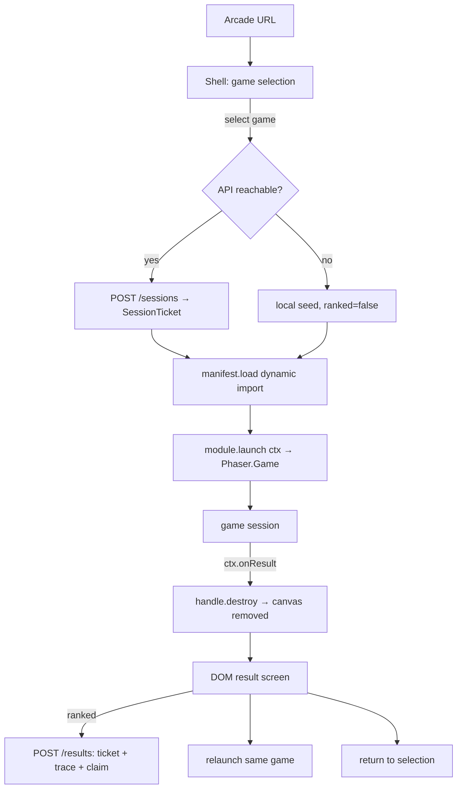

# Design Document: Arcade Platform V1

## Overview

Arcade Platform V1 turns the Rug Pull Rumble repo into a multi-game crypto meme arcade. A DOM shell lists and launches games; each launched game creates and owns its own Phaser 4 instance and is destroyed cleanly on exit. Games share exactly four things: the shell contract (`packages`-level types + context callbacks), the controls layer (`packages/controls`), the client/server protocol (`packages/protocol`), and asset conventions. Everything that gives a game its feel — simulation, renderers, camera, tuning — stays inside the game.

Because players will eventually earn crypto, ranked scores are made *structurally* trustworthy rather than policed: the server issues the seed, the client records the full input trace, and the server re-runs the game's deterministic simulation to compute the canonical score. This works because the existing `@rpr/sim` discipline (pure, fixed-step, seeded, headless-testable) is enforced platform-wide; it is the design's load-bearing wall.

### Key Design Decisions

1. **DOM shell, not Phaser scenes:** Game selection, result/share, settings, and orientation prompts are text-and-buttons surfaces; DOM does these better, is responsive for free, and keeps the shell alive across game teardown. Satisfies Requirements 1, 4, 7.
2. **One Phaser instance per launched game:** `new Phaser.Game` on launch, `game.destroy(true)` on exit. No scene-key discipline, no texture/audio accumulation, per-game scale/orientation config. Teardown cost is irrelevant at 60–180 s sessions. Satisfies Requirement 3.
3. **Dynamic import per game:** Manifests carry `load: () => import(...)`; Vite code-splits each game; the shell payload stays small. Satisfies Requirement 3.5.
4. **Controls extracted now, semantics per-game:** Both consumers (RPR, Squadron) and the mobile requirement are known, so the device layer (frames, sources, touch overlay, merging) is shared. The *meaning* of inputs (frame → `CombatInput`) stays in each game's sim. No central action enum. Satisfies Requirements 5, 6.
5. **Controls package is Phaser-free:** Keyboard binds to `window` key events (the current Phaser-plugin wrapper adds nothing); the package is headless-testable and renderer-agnostic. Satisfies Requirement 5.2.
6. **Server-authoritative ranked scores via replay verification:** Ticket (server seed) → play → trace → server re-simulation. Verifying a 2-minute 60 Hz session is milliseconds of pure TS, so *every* submission is verified — no sampling, no heuristic trust. Satisfies Requirements 8–10.
7. **Honest trust boundary:** Replay verification authenticates the simulation, not the human. Bots are mitigated by reward design (caps, review windows), stored-trace review tooling, and later server-side heuristics — never client-side anti-cheat. Satisfies Requirements 10.6, 14, 16.4.
8. **Unranked fallback:** No API ⇒ local seed, full playability, no submission. Development, outages, and offline play all keep working. Satisfies Requirement 9.5.
9. **Pseudo-3D by projection, not engine:** Squadron scales/sorts 2D sprites by `z`; one formula, no 3D dependency. Satisfies Requirement 12.1.
10. **Folders until a second consumer exists:** Only `controls` and `protocol` become packages (protocol's second consumer is `apps/api`; controls' is Squadron + the touch overlay). The shell stays `apps/web/src/arcade/`. Satisfies Requirement 16.8.

## Architecture

### Project Structure

```text
rug-pull-rumble/
├── apps/
│   ├── web/
│   │   └── src/
│   │       ├── main.ts                    # boots the shell
│   │       ├── arcade/                    # DOM shell (folder, not package)
│   │       │   ├── types.ts               # manifest/module/context/handle
│   │       │   ├── registry.ts            # ArcadeGameManifest[]
│   │       │   ├── shell.ts               # select → launch → result loop
│   │       │   ├── result-screen.ts       # shared DOM result/share screen
│   │       │   ├── settings.ts            # localStorage settings (muted, …)
│   │       │   ├── orientation.ts         # rotate prompt + pause hook
│   │       │   ├── services/
│   │       │   │   ├── sessions.ts        # ticket fetch + unranked fallback
│   │       │   │   ├── results.ts         # submission client + local bests
│   │       │   │   └── analytics.ts       # AnalyticsHook (no-op impl)
│   │       │   └── phaser/
│   │       │       ├── config-factory.ts  # createGameConfig(overrides)
│   │       │       ├── preload-factory.ts # manifest-driven preload scene
│   │       │       └── browser-support.ts # moved from game/support
│   │       └── games/
│   │           ├── rug-pull-rumble/       # current src/game/, moved
│   │           │   ├── index.ts           # implements ArcadeGameModule
│   │           │   ├── manifest.ts
│   │           │   ├── touch-layout.ts
│   │           │   ├── scenes/  renderers/
│   │           └── mempool-squadron/
│   │               ├── index.ts  manifest.ts  touch-layout.ts
│   │               ├── scenes/  render/       # projection renderer
│   │               └── sim/                   # or packages/squadron-sim
│   └── api/                                # minimal service
│       └── src/
│           ├── routes/ (sessions, results, leaderboard)
│           ├── verify/ (rpr.ts, squadron.ts)
│           └── store/
├── packages/
│   ├── sim/        # @rpr/sim — unchanged; imported by web AND api
│   ├── content/    # @rpr/content — unchanged
│   ├── controls/   # frames, sources, merge, touch overlay, layouts
│   └── protocol/   # tickets, results, submissions, trace encoding
└── tests/          # sim, controls, protocol, e2e
```

### Shell Lifecycle



### Ranked Session Sequence

```mermaid
sequenceDiagram
    participant Shell
    participant API
    participant Game as Game (Phaser + sim)
    participant Verify as API verify

    Shell->>API: POST /sessions {gameId}
    API->>Shell: SessionTicket {seed, sig, expiresAt}
    Shell->>Game: launch(ctx with session.seed)
    loop each fixed step
        Game->>Game: poll InputFrame → record into trace
        Game->>Game: sim.step(input)
    end
    Game->>Shell: ctx.onResult(GameResult + hashes)
    Shell->>API: POST /results {ticket, packed trace, claimedResult}
    API->>Verify: re-run sim(seed, trace) @ ticket.gameVersion
    Verify->>API: recomputed result
    alt matches claim
        API->>Shell: accepted {canonicalScore, placement}
    else mismatch / invalid ticket
        API->>Shell: rejected; flagged for review
    end
```

## Components and Interfaces

### Shell Contract (`apps/web/src/arcade/types.ts`)

```ts
export interface ArcadeGameManifest {
  id: string;                        // 'rug-pull-rumble'
  title: string;
  tagline?: string;
  version: string;                   // game/tuning version, stamped into results
  assetPrefix: string;               // 'rpr' | 'squadron'
  orientation: 'landscape' | 'portrait' | 'any';
  supportsPause: boolean;
  sessionLengthSec?: [min: number, max: number];
  leaderboards: LeaderboardCategory[];
  load(): Promise<ArcadeGameModule>;
}

export interface ArcadeGameModule {
  launch(ctx: ArcadeGameContext): ArcadeGameHandle;
}

export interface ArcadeGameHandle {
  pause?(): void;
  resume?(): void;
  destroy(): void;                   // must destroy Phaser instance + canvas
}

export interface ArcadeGameContext {
  parent: HTMLElement;
  session: GameSession;
  settings: ArcadeSettings;          // { muted: boolean, … } persisted by shell
  onScore(score: number): void;      // optional live ticks
  onResult(result: GameResult): void;// terminal, exactly once
  analytics: AnalyticsHook;
}

export interface GameSession {
  ticket?: SessionTicket;            // absent ⇒ unranked
  seed: number;
  ranked: boolean;
  startedAt: number;
}
```

No Phaser types appear in the contract (Req 2.6). Validates: Requirements 1, 2, 3.

### Protocol (`packages/protocol`)

```ts
export interface SessionTicket {
  sessionId: string;
  gameId: string;
  gameVersion: string;
  seed: number;
  issuedAt: number;
  expiresAt: number;
  sig: string;                       // HMAC, server secret
}

export interface GameResult {
  gameId: string;
  gameVersion: string;
  buildVersion: string;              // git SHA via Vite define
  sessionId: string;
  seed: number;
  outcome: 'win' | 'loss' | 'complete' | 'abort';
  score: number;
  stats: Record<string, number>;     // e.g. { maxCombo: 7, gasSaved: 420 }
  durationMs: number;
  inputTraceHash: string;            // SHA-256 of packed trace
  replayHash: string;                // hash of terminal sim state
}

export interface ScoreSubmission {
  ticket: SessionTicket;
  inputTrace: string;                // bit-packed, base64; versioned encoding
  traceEncodingVersion: number;
  claimedResult: GameResult;         // tripwire only; server recomputes
  playerHandle?: string;             // untrusted label
  clientTimestamp: number;
}

export interface LeaderboardCategory {
  id: string;                        // 'rpr.score'
  gameId: string;
  label: string;
  metric: 'score' | string;          // 'score' or a stats key
  order: 'desc' | 'asc';
  season?: string;
}
```

Validates: Requirements 8–11, 14.1.

### Controls (`packages/controls`)

```ts
export interface InputFrame<B extends string, X extends string = never> {
  buttons: Readonly<Record<B, boolean>>;
  axes: Readonly<Record<X, number>>;          // -1..1
}

export interface InputSource<B extends string, X extends string = never> {
  read(): InputFrame<B, X>;
  readonly available: boolean;
  destroy?(): void;
}

export function mergeFrames<...>(frames): InputFrame<...>;
// buttons: OR; axes: largest magnitude

export class KeyboardSource<B, X> {
  constructor(bindings: Record<B, string /* KeyboardEvent.code */>,
              digitalAxes?: DigitalAxisBindings<X>);
  // binds window keydown/keyup/blur — NO Phaser
}

export class GamepadSource<B, X> {
  constructor(bindings: GamepadBindings<B, X>, deadzone?: number);
}

export class PointerSource<X> { /* normalized position + press */ }

export interface TouchLayout<B extends string, X extends string = never> {
  zones: Array<
    | { kind: 'button'; action: B; anchor: 'left' | 'right';
        x: number; y: number; r: number; label: string }
    | { kind: 'stick'; axes: [X, X]; anchor: 'left'; r: number }   // floating
    | { kind: 'drag';  axes: [X, X]; region: 'full' | 'left' | 'right' }
  >;
}

export class TouchOverlaySource<B, X> implements InputSource<B, X> {
  constructor(parent: HTMLElement, layout: TouchLayout<B, X>);
  // DOM layer: pointer events, per-pointerId tracking, pointer capture,
  // touch-action:none; renders zones; destroy() removes the layer
}

export class TraceRecorder<B, X> {
  wrap(source: InputSource<B, X>): InputSource<B, X>; // records every read()
  pack(): Uint8Array;                                  // versioned bit-packing
  hash(): Promise<string>;                             // SHA-256
}
```

Per-game semantics stay out of this package: RPR keeps `mapRawInput` in `@rpr/sim`
(its `RawInputState` is structurally `Buttons<RprButton>`), Squadron keeps its
reducer in its sim. The `TraceRecorder` wrapping is the single trace choke point
(Req 8.3). Validates: Requirements 5, 6, 8.3–8.5.

### Shell Services

- `sessions.ts`: requests a ticket; on failure returns `{ seed: random, ranked: false }`. Timeout is short — never block play on the API.
- `results.ts`: submits ranked results; stores local personal bests for unranked; surfaces placement on the result screen.
- `analytics.ts`: `track(event: string, props?: Record<string, unknown>)` — no-op/console implementation in V1.
- `settings.ts`: localStorage-backed; replaces the registry-only `muted` flag.
- `orientation.ts`: matchMedia orientation watch → rotate prompt overlay → `handle.pause()`/`resume()` when supported.

Validates: Requirements 4, 7, 9, 11.

### API (`apps/api`)

Minimal TypeScript service (Fastify/Hono on Node, or Workers — the sims are
runtime-agnostic pure TS). Routes:

- `POST /sessions` → issue `SessionTicket` (HMAC over payload; server-chosen seed; expiry = max session length + slack). Rate-limited per IP.
- `POST /results` → validate ticket (sig, unused, unexpired, known `gameVersion`/`buildVersion`), unpack trace, dispatch to `verify/<gameId>.ts`, compare to claim, store `{ result, trace }`, return canonical score + placement. Single-use enforcement via unique index on `sessionId`.
- `GET /leaderboards/:categoryId` → verified submissions only.

`verify/rpr.ts` imports `@rpr/sim` + `@rpr/content`, replays the fight headlessly
(the same thing `tests/sim/full-fight.test.ts` already does), and recomputes the
`GameResult`. Storage: SQLite/Postgres — results, traces, review flags. No auth,
no accounts, no payouts. Validates: Requirements 9, 10, 11.

### Squadron Simulation and Projection

Sim: entity array `{ id, kind, x, y, z, vx, vy, vz, hp, radius }`, `z ∈ [0..1]`
(1 = spawn plane, 0 = camera). Fixed-step update; seeded spawner reading a
mission timeline `{ atSec, spawn, pattern }`; events out. Shots advance `z` and
hit the first enemy within a z-window and screen-space radius. Hazards are
entity kinds with telegraphs (frames-until-active), matching how RPR moves
telegraph with startup frames.

Renderer (game-side, Phaser):

```ts
scale(z)  = near / (near + z * depth)     // near≈0.2, depth≈3
screenX   = cx + e.x * scale(z) * halfW
screenY   = cy + e.y * scale(z) * halfH
sprite.setScale(base * scale(z)).setDepth(1000 - z * 1000)  // + fog tint by z
```

One sprite per entity, synced from sim state each render frame — the same
presentation-follows-simulation rule as RPR (its Property 10).
Validates: Requirement 12.

### Replay Viewer (dev tool)

Route/flag in the web app: paste or load a stored `(seed, trace)`, instantiate
the game's engine + renderers, and step it — optionally at adjustable speed.
Zero new rendering code; this is the manual-review tool for payout-tier scores
and the best combat debugging tool the project can have.
Validates: Requirement 14.2.

## Correctness Properties

Property 1: **RPR continuity** — At every migration commit, Rug Pull Rumble is playable menu → fight → KO → result, and the sim/content/e2e suites pass. Validates: Requirement 15.

Property 2: **Game isolation** — No module under `games/<a>/` imports from `games/<b>/`; games import only `arcade/types`, `controls`, `protocol`, and their own packages. Enforceable by lint rule. Validates: Requirements 2.5, 16.1–16.2.

Property 3: **Clean teardown** — After `handle.destroy()`, no canvas, WebGL context, audio node, or global listener from the launched game remains. Two sequential launches behave identically to first launches. Validates: Requirement 3.

Property 4: **Client never authoritative** — No ranked leaderboard row exists whose score was not recomputed server-side from `(ticket.seed, trace)`. Validates: Requirements 9.7, 10.1–10.2.

Property 5: **Ticket single-use** — For any `sessionId`, at most one submission is ever accepted. Validates: Requirement 9.4.

Property 6: **Determinism** — For any game, seed, and trace, re-running the simulation yields an identical terminal state hash on any runtime. CI enforces per game with recorded fixtures. Validates: Requirement 8.

Property 7: **Offline playability** — With the API unreachable, every game launches, plays, and reaches the result screen (unranked). Validates: Requirement 9.5.

Property 8: **Input equivalence** — Keyboard, gamepad, and touch produce frames in the same action space per game; sources merge without precedence bugs (OR/max). Validates: Requirements 5.5, 6.4, 6.5.

Property 9: **Contract completeness** — The shell operates any conforming game using only manifest + module + handle + context; adding a game touches the registry and its own folder, nothing else. Validates: Requirements 1, 2.

Property 10: **Trace fidelity** — The packed trace decodes to exactly the frames the simulation consumed, in order, with its encoding version. Validates: Requirement 8.3–8.4.

## Error Handling

| Condition | Handling |
|---|---|
| Game module dynamic import fails | Shell error surface + return to selection (Req 1.6); other games unaffected. |
| API unreachable / ticket request times out | Unranked session with local seed; badge the session as unranked (Req 9.5). |
| Submission rejected (verify mismatch) | Result screen shows unranked outcome + generic error; server flags submission for review (Req 10.2). |
| Ticket expired mid-session (long pause) | Submit anyway; server rejects politely; result shown as unranked. |
| Orientation requirement unmet | Rotate prompt overlay; `pause()` if supported; resume on rotate (Req 7.3). |
| Touch device loses a pointer (cancel/leave) | Overlay releases that pointer's zone; no stuck inputs (mirrors keyboard blur handling). |
| Game throws during launch | Shell catches, destroys partial handle, shows error, returns to selection. |
| `onResult` called twice | Shell ignores subsequent calls; logs in dev. |

## Testing Strategy

- **Controls unit tests** (`tests/controls/`): keyboard/gamepad/pointer sources headlessly (DOM events via jsdom), merge semantics, touch layout hit-testing, trace pack/unpack round-trip, recorder fidelity.
- **Protocol tests**: trace encoding versioning; ticket signature verify.
- **Determinism fixtures** (per game): recorded `(seed, trace, terminalHash)`; replay and assert. This is the CI tripwire for Req 8.7.
- **API tests**: ticket issuance/expiry/single-use, verify accept/reject, leaderboard reads exclude unverified rows.
- **E2E (Playwright)**: shell loads → selects RPR → fight plays with keyboard → KO → result screen shows score/share/hooks → replay relaunches. Mobile-viewport project: rotate prompt appears in portrait for RPR; touch overlay zones dispatch inputs (pointer event synthesis). Update existing specs for the shell entry flow (`window.__game` set at launch).
- **Manual QA**: RPR touch layout on a real mid-range Android phone (control feel cannot be asserted in CI); Squadron drag-aim feel; audio unlock on iOS Safari.

## Requirement Coverage Matrix

| Requirement | Covered By |
|---|---|
| 1 Arcade Shell | shell.ts, registry, dynamic import, e2e shell flow |
| 2 Module Contract | arcade/types.ts, RPR + Squadron index.ts, Property 9 |
| 3 Phaser Lifecycle | config-factory, launch/destroy, Property 3 |
| 4 Result/Share Flow | result-screen.ts, distribution hooks, e2e result tests |
| 5 Controls Package | packages/controls, RPR port, controls unit tests |
| 6 Touch Controls | TouchOverlaySource, TouchLayout, RPR/Squadron layouts, mobile e2e |
| 7 Mobile Viewport | shell viewport hygiene, orientation.ts, manifest orientation |
| 8 Determinism + Trace | TraceRecorder, seed injection, hashes, determinism fixtures |
| 9 Backend + Tickets | apps/api sessions route, sessions.ts fallback, Property 5, 7 |
| 10 Replay Verification | verify/rpr.ts + squadron.ts, Property 4, API tests |
| 11 Leaderboards | manifest categories, leaderboard route, result screen placement |
| 12 Mempool Squadron | squadron sim + projection renderer + mission data |
| 13 Asset Conventions | assets/shared + assets/games layout, namespaced keys |
| 14 Rewards Readiness | protocol fields, replay viewer, stored traces, release gate |
| 15 Migration Safety | ordered tasks, Property 1, per-step test gates |
| 16 Non-Goals | absence checks in review; Property 2 lint rule |
