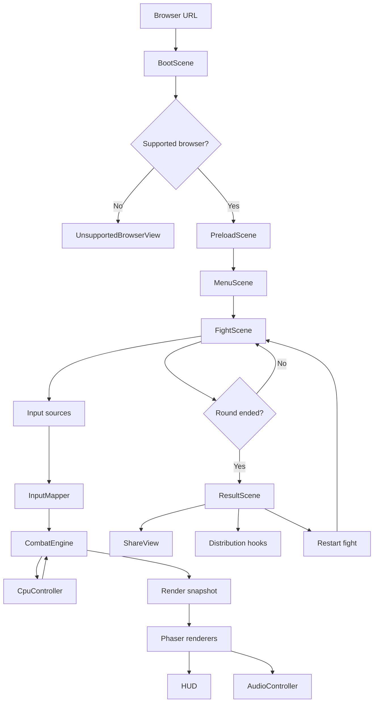
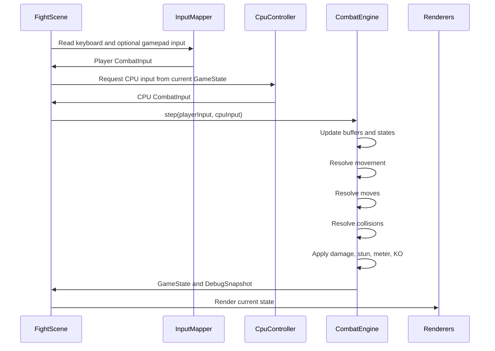
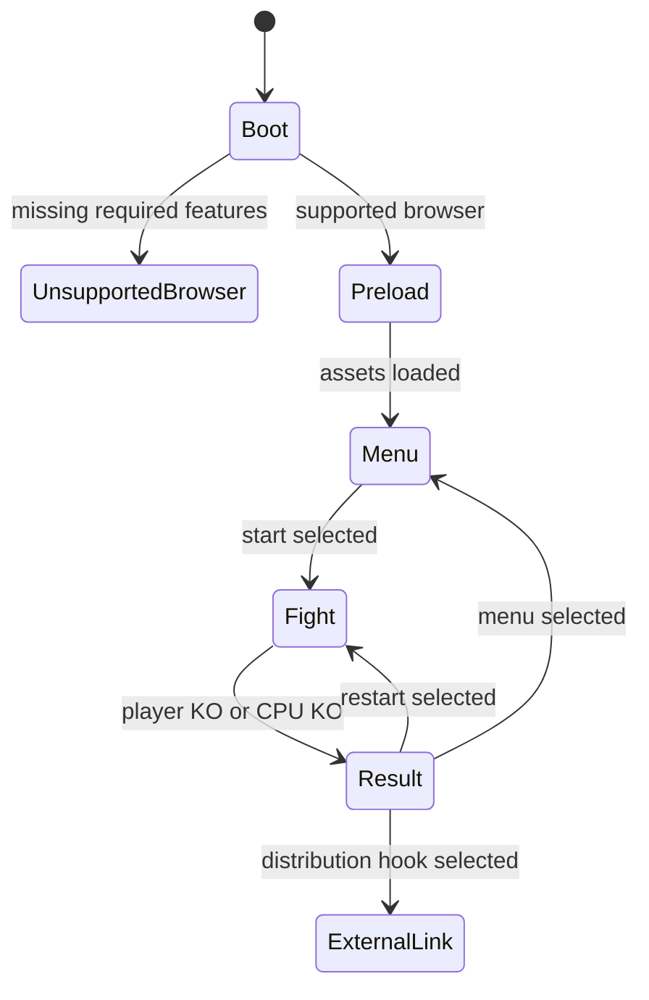

# Design Document: Proof of Fight V1

## Overview

Proof of Fight V1 is a greenfield Phaser 4 browser game that delivers a single focused Player vs CPU parody fight: Sminem vs Bogdanoff. The game runs as a static web app with no backend, no wallet, no accounts, and no install step. The implementation separates deterministic combat simulation from Phaser presentation so the core fight can be tested, tuned, replayed, and potentially extended later without rewriting the rendering layer.

V1 is intentionally scoped as a polished vertical slice. It includes one playable fighter, one CPU boss, one stage, one result flow, basic share copy, and configurable distribution links. The project is designed to optimize for speed of development, viral presentation, and clean future expansion rather than a full fighting game platform.

### Key Design Decisions

1. **Phaser 4 for browser game presentation:** Phaser 4 owns scenes, rendering, sprites, audio, input binding, cameras, particles, loading, and UI. This satisfies Requirements 1 and 2.
2. **Pure combat simulation package:** Core combat rules live outside Phaser in a TypeScript simulation package. This keeps game rules testable and prevents presentation code from corrupting combat state. This satisfies Requirements 6, 15, and 16.
3. **Static deployment only:** V1 produces static assets and does not require a backend, database, wallet, account, or blockchain interaction. This satisfies Requirements 1, 2, 13, 14, and 18.
4. **One fight, no roster system:** V1 implements only Sminem as the playable fighter and Bogdanoff as the CPU boss. This satisfies Requirement 3 and protects scope.
5. **Data-driven fighters and moves:** Fighter stats, move timing, hitboxes, hurtboxes, damage, meter behavior, presentation keys, and UI copy are defined as data. This supports rapid tuning and future character additions. This satisfies Requirements 5, 6, 7, 8, and 16.
6. **Local utility-based CPU:** Bogdanoff CPU behavior uses simple local decision rules based on distance, player state, health, meter, and random variation. No machine learning or backend AI is used. This satisfies Requirements 8 and 9.
7. **Parody-safe fictionalized presentation:** The game uses crypto meme satire and exaggerated archetypes while avoiding claims presented as factual accusations. This satisfies Requirements 4 and 17.
8. **Keyboard-first controls:** Default keyboard input is required. Gamepad can be added without making it mandatory. This satisfies Requirement 5.
9. **Fixed-step combat update:** The simulation advances at a consistent combat timestep independent of render variance. This supports responsiveness, debugging, deterministic tests, and future replay work. This satisfies Requirements 6, 15, and 16.
10. **Distribution hooks as config:** External project links and post-fight calls to action are loaded from content configuration rather than hardcoded into combat logic. This satisfies Requirement 13.

## Architecture

### Project Structure

```text
proof-of-fight/
├── apps/
│   └── web/
│       ├── index.html
│       ├── package.json
│       ├── vite.config.ts
│       └── src/
│           ├── main.ts
│           ├── game/
│           │   ├── GameConfig.ts
│           │   ├── scenes/
│           │   │   ├── BootScene.ts
│           │   │   ├── PreloadScene.ts
│           │   │   ├── MenuScene.ts
│           │   │   ├── FightScene.ts
│           │   │   └── ResultScene.ts
│           │   ├── input/
│           │   │   ├── KeyboardInputSource.ts
│           │   │   ├── GamepadInputSource.ts
│           │   │   └── InputMapper.ts
│           │   ├── render/
│           │   │   ├── FighterRenderer.ts
│           │   │   ├── StageRenderer.ts
│           │   │   ├── EffectsRenderer.ts
│           │   │   └── DebugRenderer.ts
│           │   ├── audio/
│           │   │   ├── AudioController.ts
│           │   │   └── AudioKeys.ts
│           │   └── ui/
│           │       ├── HudView.ts
│           │       ├── LoadingView.ts
│           │       ├── UnsupportedBrowserView.ts
│           │       └── ShareView.ts
│           └── content/
│               ├── gameCopy.ts
│               ├── distributionHooks.ts
│               └── assetManifest.ts
├── packages/
│   ├── sim/
│   │   └── src/
│   │       ├── index.ts
│   │       ├── constants.ts
│   │       ├── state/
│   │       ├── input/
│   │       ├── combat/
│   │       ├── cpu/
│   │       ├── data/
│   │       └── debug/
│   └── content/
│       └── src/
│           ├── fighters/
│           ├── moves/
│           ├── stages/
│           └── copy/
├── tests/
│   ├── sim/
│   └── e2e/
├── package.json
├── pnpm-workspace.yaml
└── tsconfig.base.json
```

### Runtime Architecture



### Combat Update Loop



### Scene Flow



## Components and Interfaces

### `apps/web/src/main.ts`

Initializes Phaser and mounts the game. It creates the Phaser instance, registers scenes, loads runtime configuration, and fails gracefully if initialization fails.

Validates: Requirements 1, 2, 15.

### `BootScene`

Checks browser runtime support, initializes base settings, and routes to unsupported-browser view or preload.

```ts
export interface BrowserSupportReport {
  supported: boolean;
  webgl: boolean;
  audio: boolean;
  localStorage?: boolean;
  gamepad?: boolean;
  reasons: string[];
}
```

Validates: Requirements 1.4, 1.5, 2.1.

### `PreloadScene`

Loads sprites, atlases, audio, fonts, and stage assets through the asset manifest. It shows loading progress and routes to the menu when loading completes.

Validates: Requirements 1.5, 11, 12, 15.5.

### `MenuScene`

Shows title, start action, controls hint, mute toggle, credits link, and optional distribution teaser. It starts the V1 fight without requiring character selection.

Validates: Requirements 1.6, 3.7, 3.8, 5, 12.7, 17.6.

### `FightScene`

Owns the Phaser runtime for the fight, instantiates the simulation and CPU controller, maps browser input to simulation input, advances the simulation at a fixed step, renders the current state, and routes to `ResultScene` after KO.

```ts
const SIM_FPS = 60;
const SIM_STEP_MS = 1000 / SIM_FPS;
```

The scene accumulates render delta and advances the simulation using fixed-size steps. The accumulator is capped to avoid spiral-of-death behavior after tab stalls.

Validates: Requirements 3, 5, 6, 8, 9, 10, 11, 15.

### `ResultScene`

Displays win or loss copy, restart action, share copy, optional clipboard action, configured distribution hooks, and credits or attribution if needed.

Validates: Requirements 3.5, 3.6, 7.8, 7.9, 8.7, 8.8, 10.7, 10.8, 13, 14, 17.

### `InputMapper`

Converts raw input source state into normalized simulation input.

```ts
export interface RawInputState {
  left: boolean;
  right: boolean;
  up: boolean;
  down: boolean;
  block: boolean;
  light: boolean;
  heavy: boolean;
  special: boolean;
  super: boolean;
  start: boolean;
  mute: boolean;
}

export interface CombatInput {
  horizontal: -1 | 0 | 1;
  vertical: -1 | 0 | 1;
  block: boolean;
  light: boolean;
  heavy: boolean;
  special: boolean;
  super: boolean;
}

export const DEFAULT_KEYBOARD_BINDINGS = {
  left: "ArrowLeft",
  right: "ArrowRight",
  up: "ArrowUp",
  down: "ArrowDown",
  block: "ShiftLeft",
  light: "KeyZ",
  heavy: "KeyX",
  special: "KeyC",
  super: "KeyV",
  start: "Enter",
  mute: "KeyM"
} as const;
```

Validates: Requirements 5.1 through 5.11.

### `CombatEngine`

Pure TypeScript simulation engine. No Phaser imports are allowed.

```ts
export interface CombatEngine {
  readonly state: GameState;
  step(playerInput: CombatInput, cpuInput: CombatInput): StepResult;
  reset(seed?: number): void;
  getDebugSnapshot(): CombatDebugSnapshot;
}

export interface StepResult {
  state: GameState;
  events: CombatEvent[];
  debug: CombatDebugSnapshot;
}
```

Responsibilities:

- Maintain round state.
- Advance fighter state machines.
- Resolve input buffers.
- Resolve moves.
- Resolve movement and facing.
- Resolve hitbox, hurtbox, and pushbox interactions.
- Apply health, meter, hitstun, blockstun, KO, and result state.
- Emit events for rendering and audio.

Validates: Requirements 6, 7, 8, 10, 15, 16.

### `CollisionSystem`

```ts
export interface CollisionSystem {
  resolvePushboxes(state: GameState): void;

  findHitContacts(
    attacker: FighterState,
    defender: FighterState,
    move: MoveRuntimeState
  ): HitContact[];
}
```

Collision boxes are expressed in fighter-local coordinates and transformed based on world position and facing direction.

Validates: Requirements 6.1, 6.3, 6.6, 6.7, 6.8, 16.2.

### `MoveResolver`

```ts
export interface MoveResolver {
  canStartMove(
    fighter: FighterState,
    moveId: MoveId,
    state: GameState
  ): boolean;

  startMove(
    fighter: FighterState,
    moveId: MoveId,
    state: GameState
  ): void;

  advanceMove(
    fighter: FighterState,
    state: GameState
  ): MoveAdvanceResult;
}
```

Responsibilities:

- Enforce move startup, active, and recovery windows.
- Enforce invalid action handling.
- Select hitbox and hurtbox frames.
- Track whether a move has already hit during the current execution.

Validates: Requirements 5.9, 6.1, 6.4, 6.5, 7, 8.

### `MeterSystem`

```ts
export interface MeterSystem {
  applyMeterEvent(
    fighter: FighterState,
    event: MeterEvent,
    state: GameState
  ): void;

  canSpendMeter(fighter: FighterState, amount: number): boolean;
  spendMeter(fighter: FighterState, amount: number): boolean;
}
```

Validates: Requirements 7.5, 7.6, 7.7, 10.3, 10.5.

### `RoundResolver`

```ts
export interface RoundResolver {
  checkRoundEnd(state: GameState): RoundEndResult | null;
  applyRoundEnd(state: GameState, result: RoundEndResult): void;
}

export interface RoundEndResult {
  winner: FighterId;
  loser: FighterId;
  reason: "ko";
  finalFrame: number;
}
```

Validates: Requirements 3.4, 3.5, 6.9, 8.7, 8.8, 10.7.

### `CpuController`

```ts
export interface CpuController {
  decide(state: GameState, profile: CpuProfile): CombatInput;
}

export interface CpuProfile {
  id: string;
  reactionFrames: number;
  aggression: number;
  blockChance: number;
  punishChance: number;
  throwPressureChance: number;
  specialChance: number;
  randomSeedOffset: number;
}
```

`BogdanoffBossBrain` makes decisions from distance to Sminem, current fighter states, current frame, health, meter, block frequency, recent whiffs, and seeded variation.

Validates: Requirements 8 and 9.

### Renderers and UI

- `FighterRenderer` maps simulation state to sprites or placeholder shapes and flips presentation based on facing.
- `StageRenderer` renders the V1 stage.
- `EffectsRenderer` spawns hit sparks, block sparks, screen shake, freeze frames, and special or super effects.
- `HudView` renders health, meter, round text, KO, win, loss, and restart hints.
- `AudioController` plays UI, attack, hit, block, special, super, win, loss, and KO sounds with mute support.
- `ShareView` renders share text, share URL, and clipboard fallback.
- `DistributionHookView` renders configurable project links on the result screen.
- `DebugRenderer` draws debug overlays only when debug mode is enabled.

Validates: Requirements 10, 11, 12, 13, 14, 16.

## Data Models

### Game State

```ts
export interface GameState {
  frame: number;
  seed: number;
  status: RoundStatus;
  player: FighterState;
  cpu: FighterState;
  stage: StageRuntimeState;
  lastEvents: CombatEvent[];
}

export type RoundStatus =
  | "intro"
  | "active"
  | "player_win"
  | "cpu_win"
  | "paused";
```

### Fighter State

```ts
export interface FighterState {
  id: FighterId;
  definitionId: FighterDefinitionId;
  side: FighterSide;
  health: number;
  maxHealth: number;
  meter: number;
  maxMeter: number;
  position: Vec2;
  velocity: Vec2;
  facing: FacingDirection;
  grounded: boolean;
  currentState: FighterActionState;
  currentMove: MoveRuntimeState | null;
  inputBuffer: BufferedInput[];
  stunFramesRemaining: number;
  blockstunFramesRemaining: number;
  hitstopFramesRemaining: number;
  hasLost: boolean;
  runtimeFlags: FighterRuntimeFlags;
}

export type FighterSide = "player" | "cpu";
export type FacingDirection = "left" | "right";

export type FighterActionState =
  | "idle"
  | "walk_forward"
  | "walk_backward"
  | "crouch"
  | "jump"
  | "attack"
  | "block"
  | "hitstun"
  | "blockstun"
  | "ko";
```

### Fighter Definition

```ts
export interface FighterDefinition {
  id: FighterDefinitionId;
  displayName: string;
  parodyArchetype: string;
  maxHealth: number;
  maxMeter: number;
  walkSpeed: number;
  backWalkSpeed: number;
  jumpVelocity: number;
  gravity: number;
  pushbox: Box;
  defaultHurtboxes: FrameBoxSet;
  moves: FighterMoveMap;
  animationKeys: FighterAnimationKeys;
  audioKeys: FighterAudioKeys;
  copyKeys: FighterCopyKeys;
}
```

### Move Definition

```ts
export interface MoveDefinition {
  id: MoveId;
  displayName: string;
  inputCommand: MoveInputCommand;
  category: MoveCategory;
  startupFrames: number;
  activeFrames: number;
  recoveryFrames: number;
  damage: number;
  chipDamage: number;
  hitstunFrames: number;
  blockstunFrames: number;
  hitstopFrames: number;
  meterGainOnUse: number;
  meterGainOnHit: number;
  meterCost: number;
  blockable: boolean;
  airborne: boolean;
  cancelWindows: CancelWindow[];
  hitboxes: TimedBox[];
  hurtboxes?: TimedBox[];
  effects: MovePresentation;
}

export type MoveCategory = "light" | "heavy" | "special" | "super" | "boss";
```

### Box Types

```ts
export interface Vec2 {
  x: number;
  y: number;
}

export interface Box {
  x: number;
  y: number;
  width: number;
  height: number;
}

export interface TimedBox extends Box {
  frameStart: number;
  frameEnd: number;
}
```

Coordinate convention:

- `position.x` and `position.y` represent the fighter anchor point.
- Positive `x` moves right.
- Positive `y` moves down.
- Boxes are local to the fighter anchor.
- Facing flips boxes horizontally.

### Move Runtime State

```ts
export interface MoveRuntimeState {
  moveId: MoveId;
  elapsedFrames: number;
  phase: MovePhase;
  hitTargets: FighterId[];
  spentMeter: boolean;
}

export type MovePhase = "startup" | "active" | "recovery" | "complete";
```

### Combat Events

```ts
export type CombatEvent =
  | HitEvent
  | BlockEvent
  | MeterEvent
  | MoveStartedEvent
  | RoundEndedEvent
  | CpuDecisionEvent;

export interface HitEvent {
  type: "hit";
  frame: number;
  attackerId: FighterId;
  defenderId: FighterId;
  moveId: MoveId;
  damage: number;
  hitstunFrames: number;
}

export interface BlockEvent {
  type: "block";
  frame: number;
  attackerId: FighterId;
  defenderId: FighterId;
  moveId: MoveId;
  chipDamage: number;
  blockstunFrames: number;
}

export interface MeterEvent {
  type: "meter";
  frame: number;
  fighterId: FighterId;
  delta: number;
  reason: "attack_used" | "hit_landed" | "hit_received" | "super_spent";
}

export interface MoveStartedEvent {
  type: "move_started";
  frame: number;
  fighterId: FighterId;
  moveId: MoveId;
}

export interface RoundEndedEvent {
  type: "round_ended";
  frame: number;
  winner: FighterId;
  loser: FighterId;
  reason: "ko";
}

export interface CpuDecisionEvent {
  type: "cpu_decision";
  frame: number;
  decision: string;
}
```

### Stage Definition

```ts
export interface StageDefinition {
  id: StageId;
  displayName: string;
  worldBounds: Box;
  floorY: number;
  camera: StageCameraConfig;
  backgroundAssetKeys: string[];
  foregroundAssetKeys: string[];
  audioKey?: string;
  copyKeys: StageCopyKeys;
}

export interface StageCameraConfig {
  minZoom: number;
  maxZoom: number;
  deadZoneWidth: number;
  deadZoneHeight: number;
}
```

### V1 Content

#### Sminem

Required V1 move concepts:

- `sminem_light`: fast low damage poke.
- `sminem_heavy`: slower higher damage attack.
- `green_candle`: crypto meme special.
- `bull_run_barrage`: meter-spending super.

Validates: Requirement 7.

#### Bogdanoff

Required V1 move concepts:

- `bogdanoff_backhand`: basic boss attack.
- `phone_slam`: dangerous heavy attack.
- `red_candle`: signature market-villain special.
- `activate_global_dump`: optional boss super if meter is included for CPU.

Validates: Requirement 8.

### Game Copy

```ts
export interface GameCopy {
  title: string;
  subtitle: string;
  roundStart: string[];
  fightStart: string[];
  playerWin: string[];
  playerLoss: string[];
  ko: string[];
  restartHint: string;
  muteHint: string;
  unsupportedBrowser: string;
}
```

Copy rules:

- All copy must fit parody meme tone.
- Copy must avoid unverified harmful factual claims.
- Copy must not use protected branding as the game identity.
- Copy must be easy to modify without touching combat logic.

Validates: Requirements 4, 10, 14, 17.

### Distribution Hook

```ts
export interface DistributionHook {
  id: string;
  label: string;
  description?: string;
  url: string;
  enabled: boolean;
  placement: "result-primary" | "result-secondary" | "menu";
}
```

Validates: Requirement 13.

## Correctness Properties

Property 1: **No install dependency**  
For any V1 deployment, the game shall start from a browser URL without requiring a wallet, account, extension, executable, or backend.  
Validates: Requirements 1.1, 1.2, 1.3, 18.5, 18.6, 18.8, 18.9.

Property 2: **Static build completeness**  
For any production build, all required V1 fight assets shall be included in the static output or referenced through the asset manifest.  
Validates: Requirements 1.3, 2.2, 2.4, 15.5.

Property 3: **Single-fight scope**  
For V1, starting the fight shall always create Sminem as Player and Bogdanoff as CPU on the configured V1 stage.  
Validates: Requirements 3.1, 3.2, 3.3, 3.7, 3.8, 18.10.

Property 4: **Invalid input safety**  
For any fighter state where an input action is not legal, the simulation shall ignore the invalid action without transitioning the fighter into an undefined state.  
Validates: Requirements 5.9, 6.4, 6.5.

Property 5: **Hit resolution correctness**  
For any active hitbox overlapping a defender hurtbox, damage and hitstun shall apply exactly once per move execution unless a move explicitly allows multiple hits.  
Validates: Requirements 6.1, 6.2.

Property 6: **Block resolution correctness**  
For any blockable attack that overlaps a blocking defender in a valid block state, blockstun and chip damage shall apply according to the move definition instead of normal hit damage.  
Validates: Requirement 6.3.

Property 7: **KO finality**  
For any fighter whose health reaches zero, the fighter shall enter KO state and the round shall stop accepting normal combat input.  
Validates: Requirements 3.4, 6.9, 8.7, 8.8.

Property 8: **Health and meter bounds**  
For any combat event, health shall remain between zero and max health, and meter shall remain between zero and max meter.  
Validates: Requirements 7.6, 7.7, 10.1 through 10.5.

Property 9: **CPU legality**  
For any CPU decision, the resulting input shall be processed through the same legality rules as player input and shall not bypass stun, blockstun, KO, recovery, or move restrictions.  
Validates: Requirements 8.1, 9.1, 9.6.

Property 10: **Presentation follows simulation**  
For any rendered frame, fighter visuals, HUD, hit effects, and audio cues shall be derived from simulation state or emitted combat events.  
Validates: Requirements 6.10, 10, 11, 12.

Property 11: **Debug isolation**  
For any public production build, intrusive debug state and hitbox overlays shall be disabled by default.  
Validates: Requirements 16.3, 16.6.

Property 12: **Distribution hook isolation**  
For any configured distribution hook, enabling, disabling, or editing the hook shall not modify combat logic or prevent replaying the fight.  
Validates: Requirements 13.2, 13.4, 13.5, 13.7.

Property 13: **Share fallback availability**  
For any browser without clipboard support, the result screen shall still display shareable text or URL.  
Validates: Requirements 14.5, 14.6.

Property 14: **Licensed asset constraint**  
For any included asset, the project shall track licensing or attribution information when required and shall not knowingly include unlicensed copyrighted assets.  
Validates: Requirements 12.8, 17.1, 17.6, 17.7.

## Error Handling

### Unsupported Browser

Condition: Missing WebGL or another required runtime capability.

Handling:

- Show `UnsupportedBrowserView`.
- Provide a short readable message.
- Do not attempt to enter `FightScene`.

Requirements: 1.4.

### Asset Load Failure

Condition: Required asset fails to load.

Handling:

- Show loading error.
- Provide retry action when possible.
- Prevent `FightScene` from starting with missing required assets.
- Allow optional noncritical assets to be skipped with fallback presentation.

Requirements: 1.5, 11, 12, 15.5.

### Audio Autoplay Blocked

Condition: Browser blocks audio playback before user interaction.

Handling:

- Keep game playable.
- Unlock audio after first valid user interaction.
- Do not block fight start on audio failure.

Requirements: 12.6.

### Invalid Input State

Condition: Player or CPU requests an action that is invalid in the current fighter state.

Handling:

- Ignore the action.
- Preserve current valid fighter state.
- Optionally emit a debug event in debug mode.

Requirements: 5.9, 6.4, 6.5, 9.6.

### Simulation Accumulator Stall

Condition: Browser tab stalls or frame delta spikes.

Handling:

- Cap accumulated simulation time.
- Resume from current valid state.
- Avoid applying an unbounded number of simulation steps in one render frame.

Requirements: 15.4, 15.7.

### Distribution Hook Missing or Disabled

Condition: A configured link is missing, invalid, or disabled.

Handling:

- Hide the hook.
- Keep result screen and restart action available.

Requirements: 13.5, 13.7.

### Clipboard Failure

Condition: Clipboard API unavailable or copy action rejected.

Handling:

- Display share text and URL manually.
- Do not block result screen.

Requirements: 14.5, 14.6.

## Testing Strategy

### Unit Tests: Simulation

Test location:

```text
tests/sim/
```

#### `combat-engine.test.ts`

Coverage:

- Starts a fight with Sminem as Player and Bogdanoff as CPU.
- Advances fixed simulation frames.
- Ignores invalid actions during hitstun, blockstun, recovery, and KO.
- Ends round on KO.
- Stops normal combat after KO.

Validates: Requirements 3, 5.9, 6.4, 6.5, 6.9.

#### `collision-system.test.ts`

Coverage:

- Active hitbox overlapping hurtbox applies hit.
- Non-overlapping hitbox does not apply hit.
- Hit applies once per single-hit move execution.
- Blocking defender receives block result for blockable attacks.
- Fighter facing flips hitboxes correctly.
- Pushboxes prevent invalid overlap.

Validates: Requirements 6.1, 6.2, 6.3, 6.6, 6.7, 6.8.

#### `move-resolver.test.ts`

Coverage:

- Light attack has faster timing than heavy attack.
- Heavy attack has higher damage than light attack.
- Special move has distinct move definition.
- Super requires sufficient meter.
- Super spends meter.
- Startup, active, recovery, and complete phases resolve correctly.

Validates: Requirements 6.4, 7.2, 7.3, 7.4, 7.5, 7.6.

#### `meter-system.test.ts`

Coverage:

- Meter increases on defined events.
- Meter cannot exceed max meter.
- Meter cannot go below zero.
- Super spend fails without enough meter.
- Super spend succeeds with enough meter.

Validates: Requirements 7.5, 7.6, 7.7, 10.3, 10.5.

#### `round-resolver.test.ts`

Coverage:

- Player win state when Bogdanoff reaches zero health.
- CPU win state when Sminem reaches zero health.
- Health clamps at zero.
- Round end emits result event.

Validates: Requirements 3.4, 3.5, 8.7, 8.8, 10.7.

#### `cpu-controller.test.ts`

Coverage:

- CPU returns legal inputs.
- CPU approaches at distance.
- CPU can attack at close range.
- CPU can punish whiffs under configured conditions.
- CPU does not act during hitstun, blockstun, recovery lockout, or KO.
- CPU behavior includes seeded variation.

Validates: Requirements 8.1, 8.9, 8.10, 9.1 through 9.8.

### Unit Tests: Content and Config

#### `content-validation.test.ts`

Coverage:

- Sminem definition includes required V1 moves.
- Bogdanoff definition includes required V1 moves.
- Stage definition exists.
- Distribution hooks are valid or disabled.
- Required copy keys exist.
- Asset manifest includes required assets.
- Asset attribution fields exist where required.

Validates: Requirements 3, 4, 7, 8, 11, 13, 17.

### Integration Tests: Phaser Scenes

Test location:

```text
tests/e2e/
```

#### `game-loads.spec.ts`

Coverage:

- Game loads from dev server.
- Loading view appears.
- Menu appears after preload.
- Start action launches fight.
- No wallet, account, extension, or backend prompt appears.

Validates: Requirements 1, 2.

#### `fight-flow.spec.ts`

Coverage:

- Sminem and Bogdanoff appear.
- Health UI appears.
- Meter UI appears.
- Keyboard movement works.
- Keyboard attacks work.
- CPU takes actions.
- KO routes to result scene.

Validates: Requirements 3, 5, 8, 9, 10.

#### `result-screen.spec.ts`

Coverage:

- Win or loss result is visible.
- Restart action works.
- Share copy appears.
- Distribution hook appears when enabled.
- Disabled hook does not break result screen.
- Mute toggle remains functional if present.

Validates: Requirements 3.6, 12.7, 13, 14.

### Manual QA Checklist

#### Combat Feel

- Movement feels responsive.
- Light attack feels fast.
- Heavy attack feels slower and stronger.
- Special move is visually distinct.
- Super move is visually and audibly distinct.
- Blocking is understandable.
- KO state is clear.
- First-time players can beat Bogdanoff after reasonable attempts.

Validates: Requirements 5, 6, 7, 8, 9, 10, 11.

#### Meme and Distribution Review

- Copy feels funny and shareable.
- Parody is obvious.
- No protected brand is used as the game identity.
- No unverified harmful factual claims are presented as fact.
- Distribution hooks point to configured project destinations.
- Share copy is short and postable.

Validates: Requirements 4, 13, 14, 17.

#### Browser Review

Minimum supported target:

- Current Chromium-based desktop browser.
- Current Firefox desktop browser if feasible.
- Current Safari desktop browser if feasible.

Checks:

- Game starts from a URL.
- Audio unlock behavior works.
- Keyboard controls work.
- Restart works.
- No backend is required.
- Static production build runs.

Validates: Requirements 1, 2, 15, 18.

## Requirement Coverage Matrix

| Requirement | Covered By |
|---|---|
| Requirement 1: Browser-Based No-Install Play | BootScene, PreloadScene, static deploy, unsupported browser handling, e2e load tests |
| Requirement 2: Phaser 4 Greenfield Foundation | Project structure, Phaser scenes, Vite static build |
| Requirement 3: V1 Fight Scope | FightScene, CombatEngine initialization, content definitions, ResultScene |
| Requirement 4: Parody Meme Presentation | Game copy config, fighter presentation keys, result text, content review |
| Requirement 5: Player Controls | KeyboardInputSource, InputMapper, CombatInput, combat state validation |
| Requirement 6: Core Combat Rules | CombatEngine, MoveResolver, CollisionSystem, RoundResolver |
| Requirement 7: Sminem Fighter Kit | Sminem FighterDefinition, Sminem move definitions, FighterRenderer, MeterSystem |
| Requirement 8: Bogdanoff CPU Boss Kit | Bogdanoff FighterDefinition, Bogdanoff move definitions, BogdanoffBossBrain |
| Requirement 9: Local CPU Behavior | CpuController, CpuProfile, BogdanoffBossBrain, CPU tests |
| Requirement 10: Health, Meter, and Round UI | HudView, CombatEvents, RoundResolver, ResultScene |
| Requirement 11: Stage and Visual Feedback | StageRenderer, EffectsRenderer, FighterRenderer, stage definition |
| Requirement 12: Audio Feedback | AudioController, asset manifest, mute control, audio unlock handling |
| Requirement 13: Distribution Hooks | DistributionHook config, DistributionHookView, ResultScene |
| Requirement 14: Shareability | ShareView, share copy config, clipboard fallback |
| Requirement 15: Performance and Responsiveness | Fixed-step simulation, asset preload, accumulator cap, static build |
| Requirement 16: Developer Debugging Support | CombatDebugSnapshot, DebugRenderer, debug mode flag |
| Requirement 17: Content Rights and Safety Constraints | Asset manifest licensing, credits, parody copy rules, content review |
| Requirement 18: V1 Non-Goals | Static architecture, no backend dependency, no wallet, no online mode, no roster requirement |
